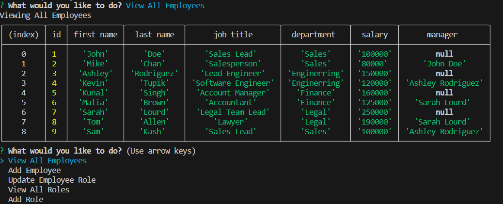

# ProManage-Hub

## Description
As a business owner, the motivation behind this project is to facilitate efficient viewing and management of company departments, roles, and employees. The project was built to provide a practical solution for business management needs, moving beyond being a mere homework assignment. It addresses the issue of time-consuming manual management by offering a user-friendly interface for handling department, role, and employee operations, making management more efficient. While building this project I learned how to interact with the database.

## Table of Contents (Optional)

If your README is long, add a table of contents to make it easy for users to find what they need.

- [Installation](#installation)
- [Usage](#usage)
- [Credits](#credits)
- [License](#license)

## Installation

1) Clone the repo: https://github.com/JosueHernand/ProManage-Hub
2) Open repo in your code editor
3) You'll need nodejs too: https://nodejs.org/en/download/current
4) You'll need mysql too: https://dev.mysql.com/downloads/mysql/
5) Inside termial you will type the following: npm i
    to install all packages required to run the application.

## Usage

1) Need a .env file inside of userInput folder
2) In the terminal you need to be inside of userInput
3) Run node inquirer.js

To view a demo [Click Here](https://drive.google.com/file/d/1MrzOgrkI4j2_KcuAY4t6vYuHNfLrlIUm/view)

## Credits

Raymond Bautista: https://github.com/Raymond2811

## License

Using MIT Licnese